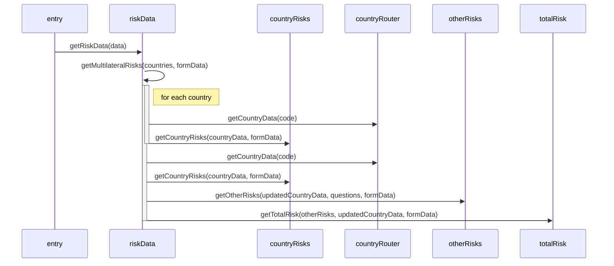

```mermaid
sequenceDiagram
    participant entry
    participant riskData
    participant countryRisks
    participant countryRouter
    participant otherRisks
    participant totalRisk

    entry->>riskData: getRiskData(data)
    activate riskData
    riskData ->>+ riskData: getMultilateralRisks(countries, formData)
    activate riskData
    Note right of riskData: for each country
    riskData ->> countryRouter: getCountryData(code)
    riskData ->> countryRisks: getCountryRisks(countryData, formData)
    deactivate riskData
    riskData ->> countryRouter: getCountryData(code)
    riskData ->> countryRisks: getCountryRisks(countryData, formData)
    riskData ->> otherRisks: getOtherRisks(updatedCountryData, questions, formData)
    riskData ->> totalRisk: getTotalRisk(otherRisks, updatedCountryData, formData)
    deactivate riskData
```
